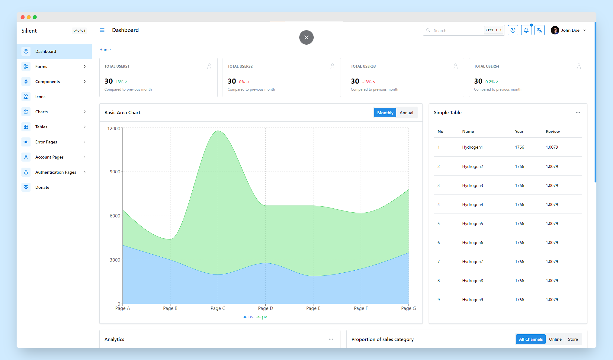

<h1 align="center">Silient Dashboard (WIP)</h1>



<p align="center">Silient is an Admin Dashboard Template created using React + Typescript + Mantine</p>
<div align="center">

[](https://github.com/rsurya99/silient-dashboard/graphs/contributors)


[](LICENSE)
[](https://GitHub.com/Naereen/StrapDown.js/graphs/commit-activity)

</div>

<p align="center">
	<a href="#">Demo Page</a>&nbsp;&nbsp;&nbsp;
	<a href="#">Documentation Page</a>&nbsp;&nbsp;&nbsp;
</p>

## Usage

```bash
# clone this repository or click 'use this template' button
$ git clone https://github.com/RSurya99/silient-dashboard.git
# install dependencies
$ pnpm i
# serve with hot reload at localhost:3000
$ pnpm run dev
# build for production and launch server
$ pnpm run build
$ pnpm run preview
# lint the project
$ pnpm run lint
```
## Contributing

Please follow [Contributing Guide](./CONTRIBUTING.md) before contributing.

## License

Silient is under [MIT License](./LICENSE).

## Author

Silient is created by <a href="https://rsurya.me">RSurya99</a>.